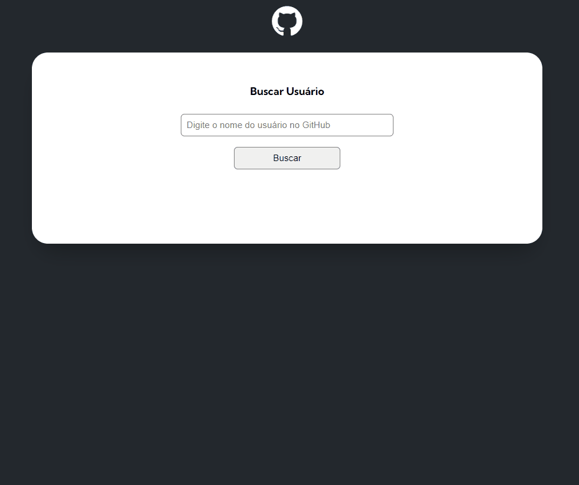

# Projeto Inicial Fetch Github Api

## O projeto comsome uma API do GitHub usando o Fetch   e busca informações do usuário renderisando na tela

 

[]

### Informações do Usuário  
- Imagem do usuário 📸
- Nome completo do usuário 🐱‍💻
- Bio do usuário 💬
- Número de seguidores do usuário 👥
- Número de pessoas que o usuário está seguindo 👥

### Informações dos repositórios do usuário
- Nome do repositório 👨‍💻
- Link do repositório 💻
- Quantidade de forks do repositório 🍴
- Quantidade de estrelas do repositório ⭐
- Quantidade de watchers do repositório 👀
- Mostrar a linguagem de programação do repositório 👨‍💻

### Informações dos últimos 10 eventos do usuário 
- Nome do repositório 👨‍💻
- Mensagem do evento.💬

### Tecnologias usadas no projeto
- HTML ✔
- CSS 🎨
- JavaScript 🧠

### Como utilizar
Digite o nome do usuário no campo "Buscar Usuário" e clique em "Buscar"